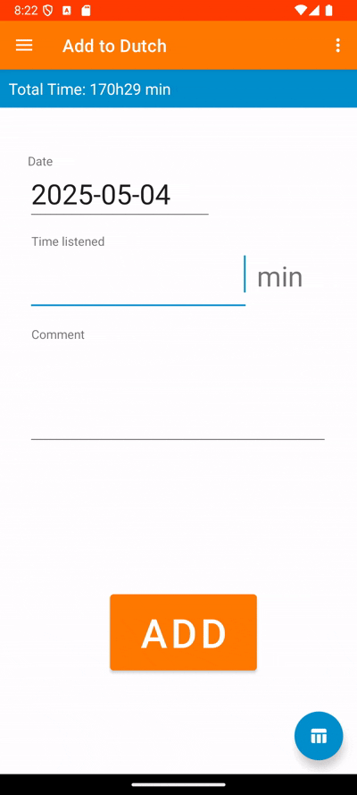
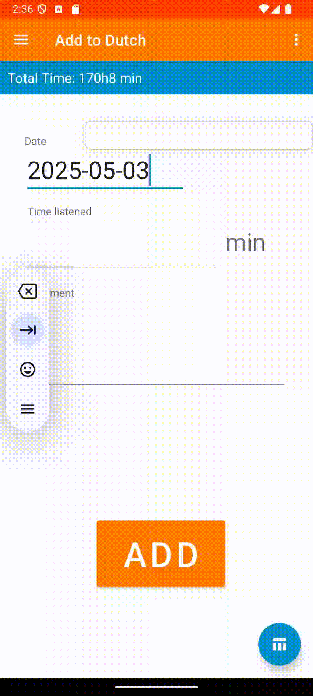
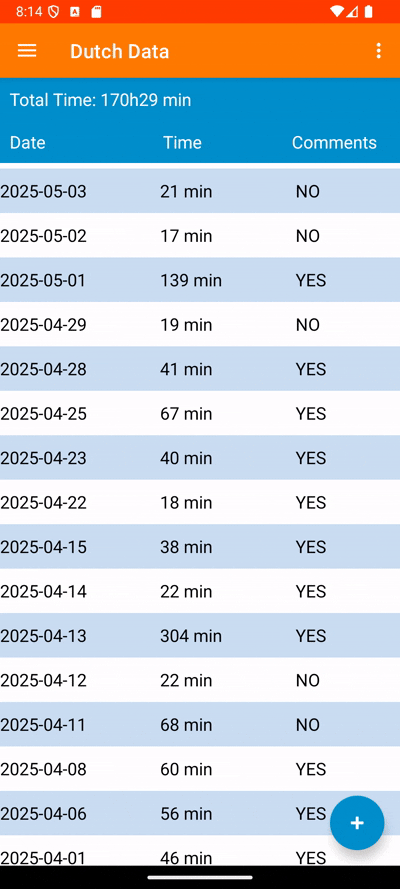

# Language Listenings
Android app for documenting the amount of time spent listening to a certain language.

## Introduction

_Language learning_ is a tedious process requiring several hundred if not thousands of hours of exposure to truly master. To many, including me, this is a daunting task. One way that I found alleviated this difficulty was _documenting my progress_, i.e. writing down how many hours of immersion I went through, preferably with a few numbers that go up and statistics to really tingle my dopamine receptors. 

This is why I created this android application: to _swiftly and satisfyingly_ be able have an overview of my language development from my phone to support my determination and help me advance towards my desired goal.

## How to use

There is a navigation bar to the left, with which you can navigate through three screens: Add, Data and Statistics.

There, you can also change the language by clicking on the flag.

The app will remember which language you last modified, and will boot it up there next time you open the app.

### Add screen

The first screen. It is used to add values to the database. The date will automatically be set to today's date, but may be changed. Comments may or may not be present.

The input is automatically controlled for date validity and non-negativity of time amount before adding. 

There is a button at the bottom right of the screen. This can be pressed to directly going to the data screen without going through the navigation bar.

### Data screen

Here, all data will be presented from newest at the top and oldest at the bottom. This screen is scrollable. By clicking on a table entry with the comment column set to `YES`, a comment screen will pop up with that date's weekday, week number, and all comments.

There is a button at the bottom right of the screen. This can be pressed to directly going to the add screen without going through the navigation bar.

### Statistics screen

You are presented with three options at the top, out of which at least one must be selected. This decides whether the day values, week averages or month averages are shown. The bottom options determine how far back you wish to look (since the first entry, since a week back [i.e. 7 days], since a month back [i.e. 30 days]). 

## Setup

Here I'll detail how to set up the project for yourself in detail, and then summarize everything in a checklist that might be easier to follow.

### How to add database

This app uses an external SQL database to record the data, making it possible to use the app from several devices (such as your computer and your phone). Regardless of what database hosting server you use, its implementation into the app will probably be rather painless, although some tweaks might be needed. For a free database hosting service, I use [filess.io](https://filess.io/).  

The databases for your different languages need not be located in the same SQL server, but the table structure must be the same as I will detail here. You will find a file called `function.sql` in this GitHub repository. This shows the structure of an example database (pertaining to a schema `langs` and with the name `Dutch`). Modify this to your needs, and then add tables on this form, along with the function `add_index`. Once tables of the same structure as the example database and the function are added, your database should now be compatible with the application.

The name of the schema + database for each language is handled in the `app/java/com.example.languagelistening/LanguageDict.java` file, along with other language-specific information. More information on this in the section below. Specific URLs can be added in `gradle.properties` by replacing the value `DB_URL` with the url to your database (several variables can be created if need be). 

### How to add your own languages

Adding or modifying languages is done in the same `LanguageDict.java` file as above, in the `generateDict()` function. There, the name of the language, connection url, schema + database name, flag image and color style can be changed. App localization is WIP. 

Custom schemas can be created in `app/res/values/themes/themes.xml`. These may refer to custom colors, which are defined in `app/res/values/colors.xml`. 

Custom flag images can be added in `app/src/main/res` under the folders `hdpi`, `mdpi`, `xhdpi`, `xxhdpi`, `xxxhdpi`. Converting pngs to the relevant 5 filetypes can be easily done through [this website](https://romannurik.github.io/AndroidAssetStudio/index.html). Rounding the flag image can be done [here](https://onlinepngtools.com/round-png-corners).

### TL;DR: Checklist for setting up the project

1. Create SQL database (e.g. through [filess.io](filess.io)).
2. Create schema and add the function `add_index()` to the schema. Add tables with the specific form as in `function.sql`.
3. Customize your colors in `colors.xml`. Create your custom themes in `themes.xml`.
4. Customize your language flag.
5. In `LanguageDict.java`, find the function `generateDict()` and add or modify all the languages you wish to have with your values.
6. Build your .apkg-file.
