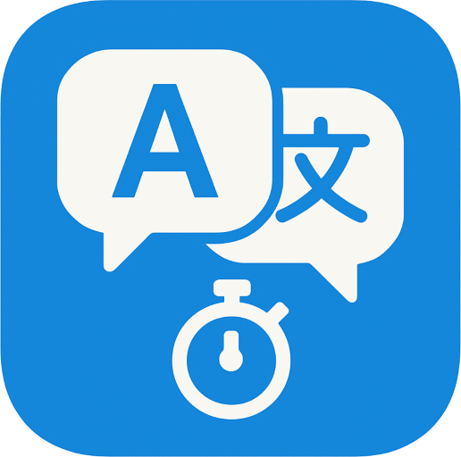
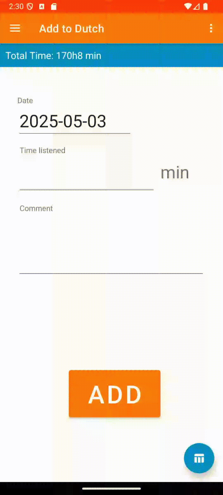
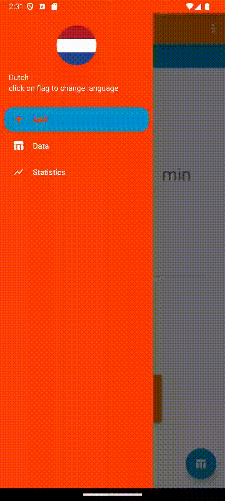
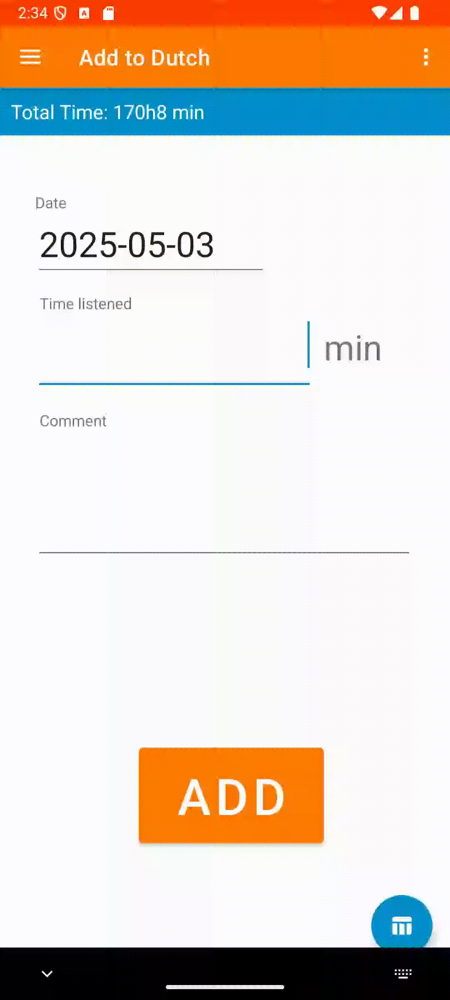
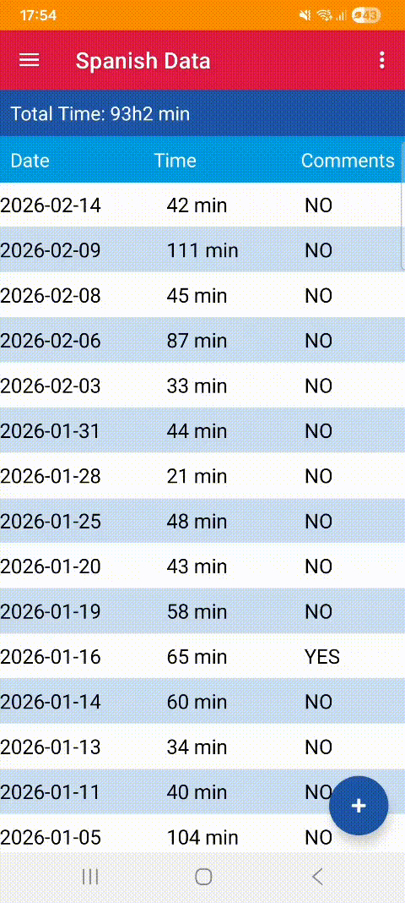
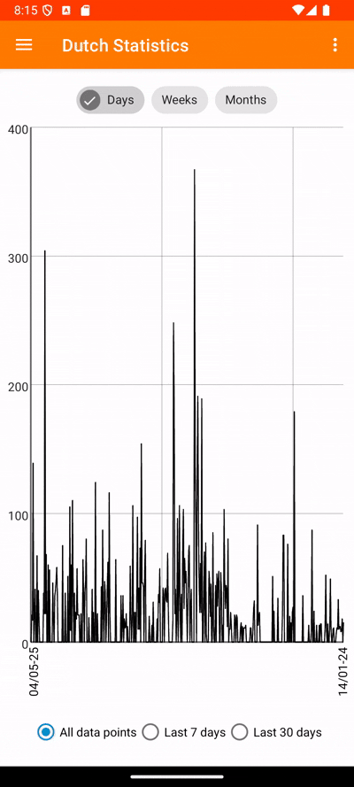

# Language Listenings
Android app for documenting the amount of time spent listening to a certain language.

## Introduction

_Language learning_ is a tedious process requiring several hundred if not thousands of hours of exposure to truly master. To many, including me, this is a daunting task. One way that I found alleviated this difficulty was _documenting my progress_, i.e. writing down how many hours of immersion I went through, preferably with a few numbers that go up and statistics to really tingle my dopamine receptors. 

This is why I created this android application: to _swiftly and satisfyingly_ be able have an overview of my language development from my phone to support my determination and help me advance towards my desired goal.

## How to use

<table>
  <tr>
    <th align="center">Feature</th>
    <th align="center" colspan="3">Gifs</th>
  </tr>
  <!-- Navigation bar -->
  <tr>
    <td valign="top" width="400">
      <b>Navigation bar</b> 
      

      <ul>
        <li> Tap hamburger icon to the left
        <li> Navigable screens:
        <ul>
            <li> Add screen
            <li> Data screen
            <li> Statistics screen
        </ul>
        <li> Change language by clicking on flag
        <ul>
            <li> Language offer customizable
            <li> See how to add languages <a href="#Setup">below</a>
        </ul>
        <li> App remembers which language you last modified
        <ul>
            <li> Automatically boots it up next time you open the app
        </ul>
      </ul>
    </td>
    <td align="left" valign="top">
        

          
<b>🧭Navbar</b>

          
        

        

          
<b>🌐Language</b>

          
        

    </td>
  </tr>
  <!-- Add screen -->
  <tr>
    <td valign="top" width="400">
      <b>Add screen</b> 
      

      <ul>
        <li> Default screen
        <li> Add values to database
        <ul>
            <li> Date automatically set to today (may be changed)
            <li> Comment is optional
        </ul>
        <li> Input is controlled
        <ul>
            <li> Date is valid
            <li> Time is positive integer
        </ul>
        <li> Press button at bottom right to go to data screen
        <ul>
            <li> Faster and more handy than passing through navigation bar
        </ul>
      </ul>
    </td>
    <td align="left" valign="top">
        

          
<b>➕Add</b>

          
        

        

          
<b>⚠️Check errors</b>

          
        

        

          
<b>➡️🗂️To data</b>

          
        

    </td>
  </tr>
  <!-- Data screen -->
  <tr>
    <td valign="top" width="400">
      <b>Data screen</b> 
      

      <ul>
        <li> All previous data per date, from newest at the top to oldest at the bottom
        <li> Scrollable screen
        <li> Can click on entry to see individual listenings
        <ul>
            <li> Click on the individual listenings to change/remove
        </ul>
        <li> Button at bottom right to go directly to add sreen
      </ul>
    </td>
    <td align="left" valign="top">
        

          
<b>🗂️Data screen</b>

          
        

        

          
<b>✏️Modify data</b>

          
        

    </td>
  </tr>
  <!-- Statistics screen -->
  <tr>
    <td valign="top" width="400">
      <b>Statistics screen</b> 
      

      <ul>
        <li> See graph of listenings per date
        <li> Read it left to right
        <li> The scope of the graph can be reduced from bullets at the bottom
        <ul>
            <li> Only showcase data from previous week
            <li> Only showcase data from previous month
            <li> Showcase all data
        </ul>
        <li> Averages can be shown on top of each other from tags at the top
        <ul>
            <li> Daily average in black
            <li> Weekly average in red
            <li> Monthly average (i.e. 30 days) in blue
        </ul>
      </ul>
    </td>
    <td align="left" valign="top">
        

          
<b>📈Statistics</b>

          
        

    </td>
  </tr>

</table>

## Setup

Here I'll detail how to set up the project for yourself in detail, and then summarize everything in a checklist that might be easier to follow.

### TL;DR: Checklist for setting up the project

1. Create SQL database (e.g. through [filess.io](filess.io)).
2. Create schema and add the function `add_index()` to the schema. Add tables with the specific form as in `function.sql`.
3. Customize your colors in `colors.xml`. Create your custom themes in `themes.xml`.
4. Customize your language flag.
5. In `LanguageDict.java`, find the function `generateDict()` and add or modify all the languages you wish to have with your values.
6. Build your .apkg-file.

### How to add database

This app uses an external SQL database to record the data, making it possible to use the app from several devices (such as your computer and your phone). Regardless of what database hosting server you use, its implementation into the app will probably be rather painless, although some tweaks might be needed. For a free database hosting service, I use [filess.io](https://filess.io/).  

The databases for your different languages need not be located in the same SQL server, but the table structure must be the same as I will detail here. You will find a file called `function.sql` in this GitHub repository. This shows the structure of an example database (pertaining to a schema `langs` and with the name `Dutch`). Modify this to your needs, and then add tables on this form, along with the function `add_index`. Once tables of the same structure as the example database and the function are added, your database should now be compatible with the application.

The name of the schema + database for each language is handled in the `app/java/com.example.languagelistening/LanguageDict.java` file, along with other language-specific information. More information on this in the section below. Specific URLs can be added in `gradle.properties` by replacing the value `DB_URL` with the url to your database (several variables can be created if need be). 

### How to add your own languages

Adding or modifying languages is done in the same `LanguageDict.java` file as above, in the `generateDict()` function. There, the name of the language, connection url, schema + database name, flag image and color style can be changed. App localization is WIP. 

Custom schemas can be created in `app/res/values/themes/themes.xml`. These may refer to custom colors, which are defined in `app/res/values/colors.xml`. 

Custom flag images can be added in `app/src/main/res` under the folders `hdpi`, `mdpi`, `xhdpi`, `xxhdpi`, `xxxhdpi`. Converting pngs to the relevant 5 filetypes can be easily done through [this website](https://romannurik.github.io/AndroidAssetStudio/index.html). Rounding the flag image can be done [here](https://onlinepngtools.com/round-png-corners).
